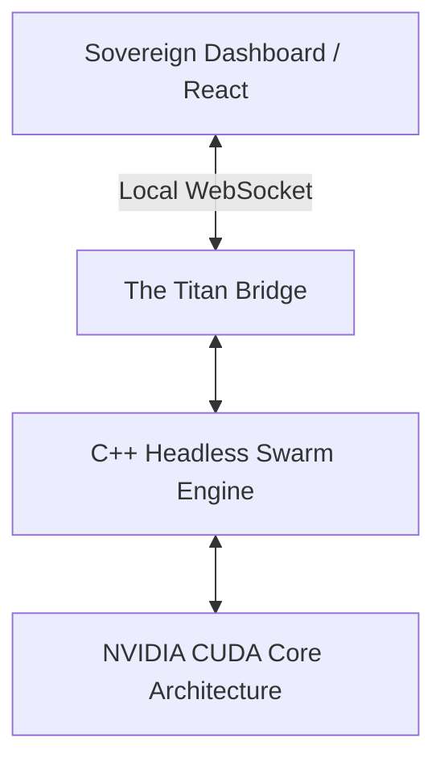

# SOVEREIGN SWARM — [locallab.sbs]

> **The World’s Most Parameter-Efficient Autonomous Agent Dashboard.**
> Built with Native C++ and NVIDIA CUDA for High-Performance Swarm Simulation.

---

## 🏛️ ARCHITECTURE OVERVIEW

Sovereign is a "Brain-First" AI platform. Unlike generic LLM-wrappers that rely on slow, expensive cloud APIs, Sovereign operates directly on your local silicon.



### 1. The Titan Protocol (Core Engine)
Located in `/core`, the Sovereign engine uses a high-performance **1.5 Million Parameter** neural gate architecture rewritten for raw CUDA. 
- **Ultra-Efficient**: Performs 1,000s of reasoning rounds with minimal VRAM footprint.
- **Zero-Latency**: Multi-agent states persist in-memory, avoiding the "Network Wait" of typical AI platforms.
- **Truly Native**: No Python. No Heavy Frameworks. Pure high-order math on the metal.

### 2. The Sovereign Dashboard (Frontend)
Located in `/frontend`, our Next.js dashboard provides a premium visual interface for the `locallab.sbs` platform.
- **Real-Time Visualizer**: Watch the agents interact and evolve in a glassmorphic command center.
- **Live Streamed Intelligence**: Uses specialized C++ Sockets to bridge the brain to the browser.
- **GitHub Hosted**: Deployed automatically to your custom domain upon every push.

---

## 🛰️ DEPLOYMENT STATUS: `locallab.sbs`

- **Dashboard**: [LIVE] Powered by Next.js 15 & GitHub Pages.
- **Titan Engine**: [OFFLINE/LOCAL] Active development in `/core`.
- **Swarm Phase**: Stage 5 (Platform Infrastructure).

---

## 🛠️ GETTING STARTED

If you are a developer looking to explore the **Titan Protocol**, follow the instructions in [the Architecture Deep-Dive (ROADMAP.md)](./SOVEREIGN_ROADMAP.md).

### Building the Dashboard:
```bash
cd frontend
npm install
npm run dev
```

### Running the CUDA Swarm:
```bash
cd core
# Requires NVIDIA CUDA Toolkit & NVCC
run_v12_titan.bat
```

---

## 🧭 PROJECT ROADMAP

Check the [Master Roadmap](./SOVEREIGN_ROADMAP.md) for current progress. 
Currently in **Stage 5: Infrastructure First**, setting up the foundation for the upcoming **Stage 6: Online Learning Singularity.**

---

**© 2026 Sovereign Swarm Intelligence | [locallab.sbs]**
