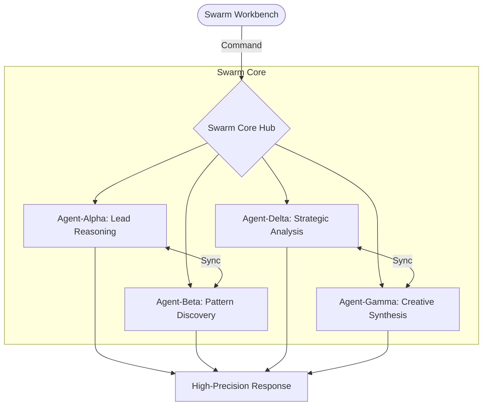

#  1.5M Parameter Local Inference Engine

<div align="center">

[](https://opensource.org/licenses/Apache-2.0)
[](https://github.com/sumithkumar07/Sovereign-Swarm-Engine)
[](https://locallab.sbs)
[](#)

**A 1.5M parameter local inference engine in C++/CUDA, runs on consumer hardware.**  
[Explore the Workbench](https://locallab.sbs) • [Technical Specs](docs/Engine_Specs.md) • [Benchmarks & Results](results/README.md)

</div>

---

## 🏛️ The Power of Local Inference
Swarm is a high-performance, 1.5M parameter neural core designed for true on-device autonomy. Operating entirely on local hardware, it orchestrates a persistent swarm of **4 Neural Agents** (Alpha, Beta, Delta, Gamma) across a 64-bit native memory bridge.

### Technical Implementation
Unlike standard transformers, Sovereign leverages a **High-Order Recurrent Core** (Clifford Initialization). Each parameter is initialized via anti-commutative Clifford algebras, ensuring gradient stability and zero-feedback convergence.

---

## 🌩️ Neural Swarm Topology



---

## 🚀 Technical Pillars

- **1.5M Parameter Core**: High-fidelity local reasoning optimized for consumer GPUs.
- **Native C++/CUDA Engine**: Direct memory access via a hardened C-Bridge for maximum performance.
- **Autonomous Weight Alignment**: Self-stabilizing neural weights through active geometric backpropagation.
- **Privacy-First Protocol**: 100% on-device. No telemetry. No cloud inference.

---

## 🛠️ Quick Start

### 1. The Workbench (UI)
```bash
cd client
npm install
npm run dev
```
Visit `localhost:3000` to access the **Sovereign Workbench**.

### 2. The Neural Engine (Core)
```bash
# Requires CUDA 12.0+
cd engine
# To build the CUDA trainer
./run_v12_titan.bat
```

---

## 📚 Repository Structure

- `client/`: Professional Next.js 15 workbench and landing page.
- `engine/`: C++ native engine core (The 1.5M Param Core).
- `results/`: Performance benchmarks, token outputs, and memory profiles.
- `docs/`: Technical deep-dives into engine logic and architecture.

---

## ⚖️ Governance & Policy
- **License**: Apache 2.0.
- **Contribution**: See [CONTRIBUTING.md](CONTRIBUTING.md).
- **Security**: Local-first by design. See [SECURITY.md](docs/SECURITY.md).

---

<div align="center">
  <p><i>Orchestrating the future of local intelligence, one agent at a time.</i></p>
  <p><b>Built with Technical Sincerity.</b></p>
</div>
